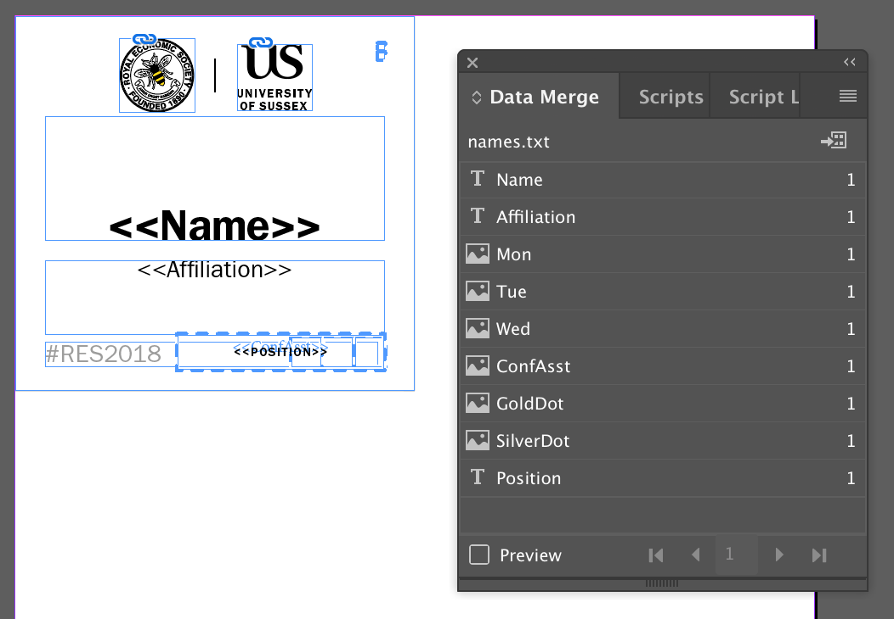
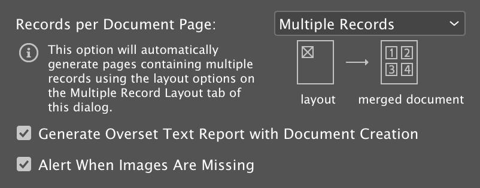
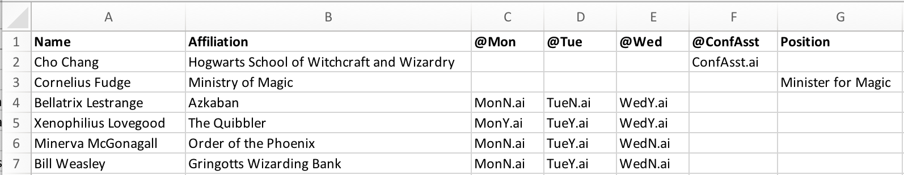
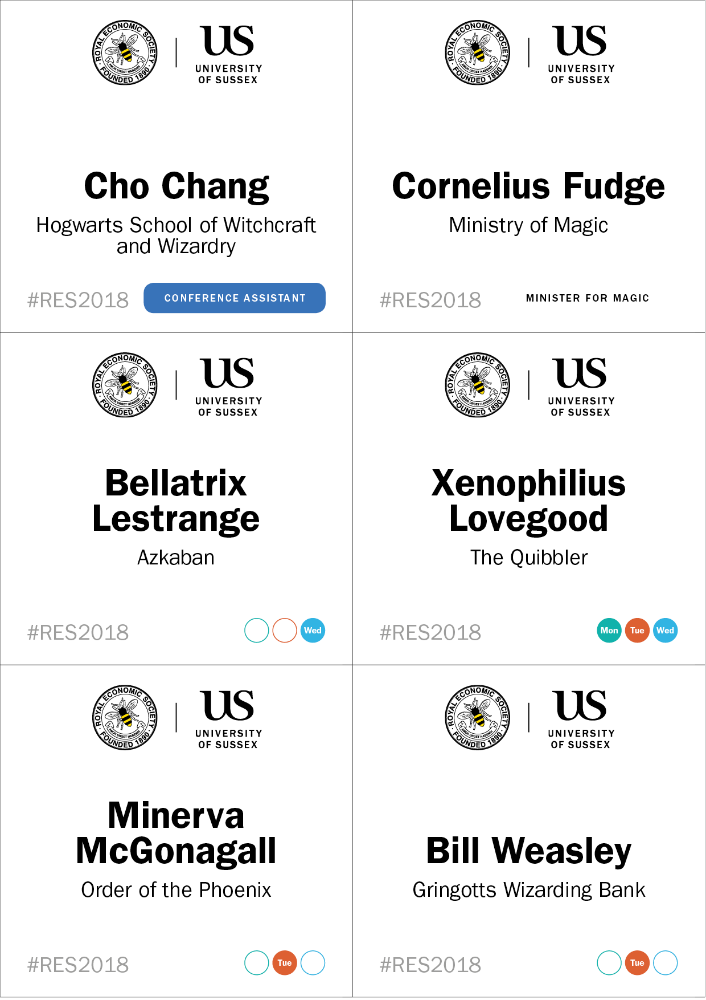
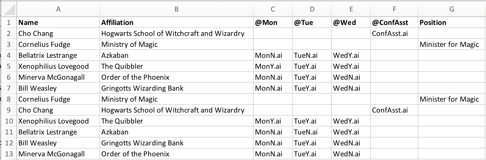

# Conference name badges

This page gives a quick walkthrough of how we made name badges for the Royal Economic Society 2018 Annual Conference in 2018, in case anyone finds it helpful. 

## Aims

We decided to design and print the name badges locally. This was in order to: 

1. reduce costs;
2. push back the deadline for finalising the delegate list; and
3. meet some specific design goals. 

The design goals were that the badges should: 

1. be reasonably attractive;
2. make clear which days delegates were registered for — or otherwise show that they had a special role, such as conference assistant; and
3. keep the delegate's name visible at all times.

We chose plain blue single-clip lanyards with 110×105mm T3 landscape PVC wallets (from [Lanyards Direct](https://www.lanyardsdirect.co.uk/product/plain-lanyards/plain-blue-lanyards/)). This was one of the cheapest options. The wallet dimensions were generous. They also let us fit 6 badges on a sheet with no trimming.

Printed on 160gsm card and cut to size, the badges ended up looking like this:

## Creating badges in InDesign using Data Merge

Adobe has good [documentation on the Data Merge features of InDesign](https://helpx.adobe.com/indesign/using/data-merge.html), which I won't repeat here. 

Our [template document](name-badges-template.indd) (with the Data Merge tab open) looked like this:

We used **text data fields** for name (George MacKerron), affiliation (University of Sussex), and position (LOCAL ORGANISER). 

We used **image fields** referencing Illustrator files for a blue 'Conference Assistant' stamp and for the day indicators. The day indicators comprised of three placeholders, each of which could reference an empty circle or a filled circle showing one of the conference days (we therefore had 6 files in all: MonY.ai, MonN.ai, TueY.ai, TueN.ai, WedY.ai, WedN.ai).

(We also had small gold dots indicating that the delegate had registered for the conference dinner, and small silver dots indicating that the delegate had special dietary requirements, but for simplicity I won't mention these again).

We set the Data Merge options to produce multiple records per page, and to lay those out row first.

We then merged the delegate [data](delegates-data.txt), which looked like this:

This produced sheets of badges ready for printing, 6 to an A4 page, which looked like this:

## Making the badges double-sided

At any given conference, [about half the people are walking around with their badge facing backwards so that no one can see their name](https://www.mattcutts.com/blog/ideal-conference-badge/).

One way to fix this is to buy double-clip lanyards. These fix to the badge at two corners, and keep it facing the right way. However, the price premium on these lanyards is pretty steep.

A simple alternative is to print the badge the same on both sides. 

Except ... it isn't all that simple. If we simply duplicate each set of 6 rows in the delegate data table, do the data merge, and then print the resulting sheets double-sided, the wrong badges end up back to back (on the top row in our above example, Cho Chang's badge will have Cornelius Fudge's details on the reverse and vice versa). 

So, what we need to is to duplicate each set of 6 rows and, _in addition_, switch each adjacent pair in the duplicated set.

That is, following the header row (1), we want to keep rows 2, 3, 4, 5, 6, 7 and then insert duplicates of those rows in the order 3, 2, 5, 4, 7, 6. And then repeat for each subsequent set of 6.

That looks like this:

Obviously this would be tedious and error-prone to do by hand, so I wrote a [short Ruby script](double-six.rb) to take in the raw tab-separated data file and spit out a new data file with right pattern of duplication.

On Mac or Linux, you can run this from Terminal by redirecting input and output data as follows:

    < delegates-data.txt ./double-six.rb > delegates-doubled.txt

## Cut the badges in batches while maintaining alphabetical order

We had around 750 badges to produce. Using a guillotine, we found that cutting in batches of three sheets (18 badges) at a time worked well.

We cut as follows. Taking three sheets together, we cut lengthways to make two columns, and stacked the left column on top of the right column. We then made two more cuts, leaving us with three stacks of six badges each. These we stacked in the same order they had appeared on the sheets — i.e. badges from the top row on top, badges from the middle row in the middle, and badges from the bottom row on the bottom.

You may think I have laboured this explanation a bit. But by following a single, consistent cutting order, we were able to make an optimisation prior to the merge. We re-ordered the rows of the delegate data so that, after we had cut the badges in these batches of 18, they would be in alphabetical order with no further sorting required.

To make this work, badge 1 should be at top left of the  sheet 1, badge 2 at top left of the sheet 2, and badge 3 at top left of sheet 3. Then badge 4 is at top right of sheet 1, badge 5 at top right of sheet 2, and badge 6 at top right of sheet 3. Then badge 7 is at mid left of sheet 1 ... and so on.

Once again I wrote [a short Ruby script](cutting-order.rb) to automate this shuffle. This can be combined with the double-siding procedure above, but the shuffle must be done **first**.

The script assumes that your original delegate data is in the same order you want the cards to come out in.

On Mac or Linux, you can run this from Terminal as follows:

    < delegates-data.txt ./cutting-order.rb 3 6 | ./double-six.rb > delegates-presorted-doubled.txt

The output file is then ready to use as the source for your Data Merge.

